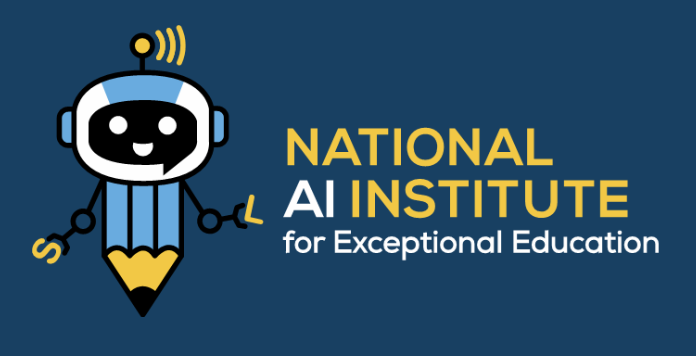

# National AI Institute for Exceptional Education
## Early Literacy Interview Avatar Demo



This is a customized Interactive Avatar application for the National AI Institute for Exceptional Education, built with Next.js and the HeyGen Streaming Avatar SDK.

## Features

- **Interactive AI Avatar**: Text-based chat interface with AI-powered avatar
- **Avatar Configuration**: Choose from multiple avatar types
- **Language Support**: Multiple language options
- **Quality Settings**: Adjustable avatar quality
- **Real-time Streaming**: WebSocket-based communication

## Getting Started

### Prerequisites

- Node.js (v18 or higher)
- npm or pnpm
- HeyGen API Key

### Setup Instructions

1. **Install Dependencies**
   ```bash
   npm install
   ```

2. **Configure Environment Variables**
   
   Create a `.env` file in the root directory:
   ```
   HEYGEN_API_KEY=your_heygen_api_key_here
   ```

   You can retrieve your API Key by logging in to HeyGen and navigating to:
   [https://app.heygen.com/settings?nav=API](https://app.heygen.com/settings?nav=API)

3. **Run the Development Server**
   ```bash
   npm run dev
   ```

4. **Open the Application**
   
   Navigate to [http://localhost:3001](http://localhost:3001) in your browser

## Usage

1. **Select Avatar Type**: Choose from the available avatar types
2. **Configure Settings**: Adjust language, quality, and other settings
3. **Start Chat**: Click the "Chat" button to begin your session
4. **Interact**: Type your messages and interact with the avatar

## Customization

This application has been customized from the original HeyGen demo with:
- Custom branding for AI4EE
- Simplified UI with text chat only
- Removed unnecessary configuration options
- Custom logo and title

## Configuration Options

- **Avatar Type**: Select from predefined avatars or use a custom avatar ID
- **Language**: Choose the avatar's language
- **Avatar Quality**: Adjust streaming quality (low, medium, high)
- **Voice Chat Transport**: WebSocket or WebRTC

## Technical Stack

- **Framework**: Next.js 15
- **Language**: TypeScript
- **Styling**: Tailwind CSS
- **SDK**: HeyGen Streaming Avatar SDK
- **State Management**: React Hooks + ahooks

## Support

For issues or questions related to the HeyGen SDK, please visit:
- [HeyGen Documentation](https://docs.heygen.com)
- [SDK GitHub](https://github.com/HeyGen-Official/StreamingAvatarSDK)

---

Built for the National AI Institute for Exceptional Education

